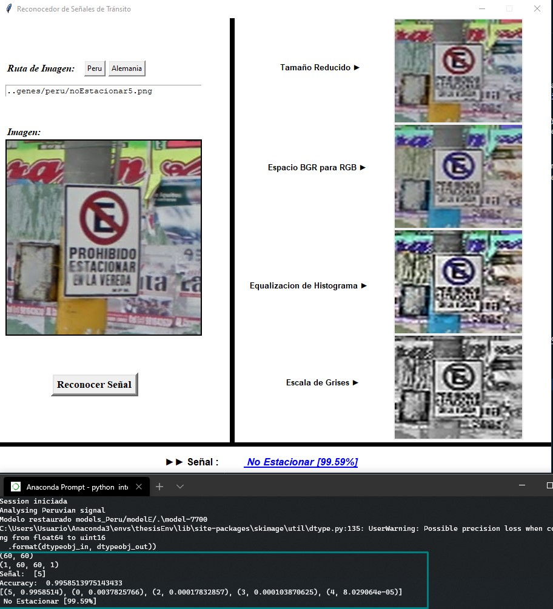

# Thesis' Project

The main objective of this research is to implement a model based on the deep learning through convolutional neural networks to automatically recognize vehicular traffic signals using image processing techniques and foundations of artificial intelligence.

The project focuses on a group of traffic signals from Germany and Peru, identifying 43 and 7 categories respectively. Starting with the acquisition of images, the processing of these activities is carried out with the purpose of increasing the data set so then be able to carry out in-depth learning through various designs of convolutional neural network architectures.

As a final result, a model with good indicators and results in the recognition of vehicular traffic signals was obtained. In this way, it is intended to contribute to the efforts of the automotive industry in the field of Advanced driver-assistance systems(ADAS), as well as being part of various mechanisms that seek to provide solutions to road safety.

# Requirements

- Download and install Anaconda lastest version
- Donwload visual studio for C++ compilator
- Download and install cuda_9.0.176_win10
- Add the CUDNN 7.3 (dll file) version for CUDA 9

```python
pip install -r reqForThesis.txt

Optional:
sudo apt-get install python3-tk
```

# Contact
Josue Gaston Tavara Idrogo - joshuatavara23@gmail.com

# Thesis
http://dspace.unitru.edu.pe/handle/UNITRU/13189

# Clasificador de Señales

